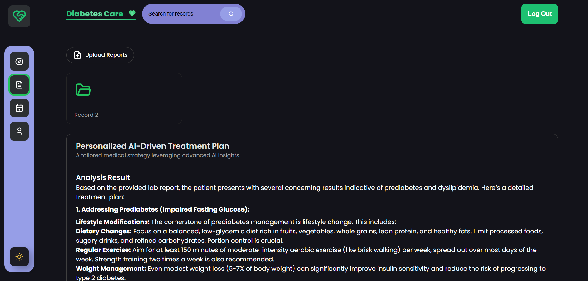

# React.js Full-Stack Development Guide

## 🌐 Website Overview  

This project includes a dedicated **website** to provide personalized and AI-powered solutions for diabetes management. The website is designed to assist patients and caregivers with tailored health plans, medical insights, and efficient management tools.

### 🌟 Key Features of the Website  
- **Personalized Health Plans**:  
  Using advanced AI (Gemini AI), the website analyzes patient data and medical records to recommend customized health and treatment plans tailored to individual needs.  

- **Blood Sugar Monitoring Insights**:  
  Track and analyze trends in blood sugar levels to help patients make informed decisions about their health.  

- **Medication and Diet Recommendations**:  
  Automated suggestions for medications, dietary plans, and exercise routines to help manage diabetes effectively.  

- **Schedule and Task Management**:  
  A user-friendly **Kanban board** helps patients track appointments, medication schedules, and health-related tasks.  

- **Secure User Accounts**:  
  Integrated with **Privy Authentication** to ensure user privacy and data security.  

- **Responsive and Modern Design**:  
  Built with **Tailwind CSS**, ensuring accessibility across all devices, including desktops, tablets, and smartphones.  

- **Community Support**:  
  Provides resources, articles, and community forums to support diabetes patients and their caregivers.

---
## 🚀 Introduction  
This guide provides an in-depth overview of building full-stack applications with **React.js**, showcasing fundamental principles and best practices. Explore the seamless integration of **AI**, **TypeScript**, modern **state management**, and responsive design while deploying scalable projects.

---

## 🛠️ Technologies and Tools  

### Frontend  
- **React.js**: Building dynamic user interfaces  
- **Tailwind CSS**: For responsive and modern design  
- **Aceternity UI**: Enhanced UI components  

### AI Integration  
- **Gemini AI**: Advanced data analysis and recommendations  

### Authentication  
- **Privy**: Secure and user-friendly authentication  

### Backend & Database  
- **Drizzle ORM**: Simplified and flexible database integration  
- **Neon**: Scalable and cloud-based database platform  

### Development & Deployment  
- **Vite**: Lightweight and fast development server  
- **Netlify / Vercel**: For hassle-free deployment  

---

## 📚 Project Highlights  

### AI-Assisted Cancer Care Planning  
- Comprehensive **patient data analysis**  
- Generation of **personalized treatment recommendations**  
- Management of screening schedules with a **Kanban board** for improved workflow  

---

## 👨‍💻 Step-by-Step Development Guide  

1. **Set Up the Project**  
   - Use Vite for a lightweight development environment:  
     ```bash
     npm create vite@latest my-app --template react
     cd my-app
     npm install
     ```
   - Install necessary dependencies for Tailwind CSS, Drizzle ORM, and AI integration.

2. **Design a Responsive Layout**  
   - Utilize Tailwind CSS for responsive components.  
   - Leverage Aceternity UI to accelerate UI design.  

3. **Implement Authentication**  
   - Integrate Privy to manage user sessions securely.  

4. **Database Design and Integration**  
   - Use Drizzle ORM for seamless interaction with Neon databases.  
   - Design schema for patient data storage and analysis.  

5. **Integrate AI for Data Analysis**  
   - Use Gemini AI for advanced insights:  
     - Predict patient outcomes.  
     - Generate personalized screening schedules.  

6. **Build Interactive UI Components**  
   - Create modular React components for dynamic data rendering.  
   - Manage global state using the Context API.  

7. **Deploy Your Application**  
   - Optimize your application for production.  
   - Deploy using platforms like Netlify, Vercel, or Render.

---

## 🛠️ Resources and Documentation  

- **Drizzle**: [Official Documentation](https://orm.drizzle.team/docs/get-started)  
- **Neon**: [Official Console](https://console.neon.tech/)  
- **TailwindCSS**: [Official Website](https://tailwindcss.com/)  
- **Aceternity UI**: [UI Library](https://shorturl.at/3p5Dp)  
- **Gemini AI**: [Integration Guide](https://aistudio.google.com/app)  
- **Privy**: [API Documentation](https://docs.privy.io/)  
- **Vite**: [Getting Started Guide](https://vitejs.dev/guide/)  

---

## 👥 Contribution  
We welcome contributions to this project! Feel free to fork the repository and submit pull requests with enhancements or fixes.

---


---

## 🖼️ Screenshots  

Below are screenshots showcasing the features and UI of the project:


### 1. Home Page


### 2. Create Record


### 3. Kanban Board


### 4. Privy Authentication


### 5. Record Management


### 6. Treatment Plan


### 7. User Profile


### 8. To-Do List


---

